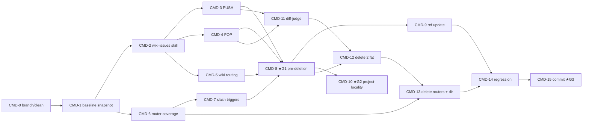

# Tasks — Command→Skill-Migration + `commands/`-Löschung

Atomare Ausführungs-Tasks für Manifest-Knoten `tasks-commands`, abgeleitet aus [PLAN-commands](../plans/PLAN-cmd-script-consolidation-commands.md) (18 Schritte / Phasen A–G / GATE 1–3). **Recorded, not executed** — reiner Refactor, gleiche Trigger → gleiches Verhalten. **Migration + Deckungsnachweis strikt VOR jeder Löschung.** Führt [FUP-3 + FUP-4](dragonscale-agentic-wiki-followups.md) aus (skill-home = neuer `wiki-issues`). Node-Done = alle Tasks `done` + Manifest-verify (`commands/ leer + Coverage-Matrix grün + Tests grün`).

## Labels
Taxonomie: [FUP-Tracker §Label taxonomy](dragonscale-agentic-wiki-followups.md). Hier: `feature` `maintenance` `review` `decision` `harness`. Surface: `code` · `doc` · `decision`.

## Tasks

| ID | Task | Labels | Surface | Source | Prio | Depends on | Acceptance (binär) |
|---|---|---|---|---|---|---|---|
| **CMD-0** | Sauberen Ausgangszustand + Arbeitsbranch herstellen | `config` `review` | config | Plan S1 | P1 | — | `git branch --show-current` = Arbeitsbranch; `git status --porcelain skills/ commands/ README.md AGENTS.md CLAUDE.md` sauber |
| **CMD-1** | Baseline-Snapshot der 7 Command-Bodies + Zielskills | `harness` `review` | code | Plan S2 | P1 | CMD-0 | `fd -e md . commands/` == 7; `git rev-parse HEAD` als Snapshot-Anker notiert |
| **CMD-2** | `skills/wiki-issues/SKILL.md` neu anlegen (Frontmatter + Datenmodell Spec §2.3) | `feature` | code | Plan S3 | P1 | CMD-1 | `test -f skills/wiki-issues/SKILL.md`; Datenmodell-Marker (`I-YYYY-NNN`, `blocked_by`, …) vorhanden; `lint-open-issues`-Refs guarded/1:1, **nicht** angelegt |
| **CMD-3** | Operation PUSH (ex-`handoff`) wortgetreu einsetzen | `feature` | code | Plan S4 | P1 | CMD-2 | Diff `handoff.md` ↔ PUSH inhaltlich leer; Commit-Format-Marker (`docs(meta): handoff`) vorhanden |
| **CMD-4** | Operation POP (ex-`fix-issues`) wortgetreu einsetzen | `feature` | code | Plan S5 | P1 | CMD-2 | Diff `fix-issues.md` ↔ POP inhaltlich leer; alle 4 Pfad-Marker `4a/4b/4c/4d` vorhanden |
| **CMD-5** | Routing-Zeile in `skills/wiki/SKILL.md` Operations-Tabelle | `maintenance` | doc | Plan S6 | P1 | CMD-2 | `rg wiki-issues skills/wiki/SKILL.md` trifft in Operations-Tabelle; genau +1 inhaltliche Zeile |
| **CMD-6** | Router-Deckung der 5 Zielskills prüfen (Coverage-Matrix) | `review` | code | Plan S7 | P1 | CMD-1 | Coverage-Matrix (Spec §2) je Router ✓ — kein Router trägt Logik ohne Skill-Entsprechung |
| **CMD-7** | Slash-Trigger-Deckung bestätigen | `review` | doc | Plan S8 | P1 | CMD-6 | je Skill: Slash-String / NL-Äquivalent als Trigger-Phrase vorhanden (`rg` je `SKILL.md`) |
| **CMD-8** | **★GATE 1** — Coverage vollständig + Skill gebaut (Deletion-Vorbedingung) | `review` `decision` | decision | Plan S9 / Gate 1 | P1 | CMD-3, CMD-4, CMD-5, CMD-7 | Human-Gate 1 abgehakt; Deletion-Preconditions-Liste alle ✓ |
| **CMD-9** | Ist-Referenzen aktualisieren (README/AGENTS/CLAUDE/roadmap) | `maintenance` | doc | Plan S10 | P1 | CMD-8 | `rg 'commands/' README.md AGENTS.md CLAUDE.md docs/upstream-roadmap.md` == 0 |
| **CMD-10** | **★GATE 2** — Sonderfall `references/…/project-locality.md:11` entscheiden | `decision` | decision | Plan S11 / Gate 2 | P1 | CMD-8 | (a) generisch behalten + Acceptance-Ausnahme dokumentiert **oder** (b) umformuliert + `rg 'commands/' references/` == 0 |
| **CMD-11** | Diff-Judge: migrierte Bodies inhaltlich deckungsgleich | `review` | code | Plan S12 | P1 | CMD-3, CMD-4 | Judge bestätigt „inhaltlich leerer Diff" für beide Paare |
| **CMD-12** | Die 2 fetten Command-Dateien löschen | `feature` `maintenance` | code | Plan S13 | P1 | CMD-8, CMD-11 | `fix-issues.md` + `handoff.md` beide entfernt |
| **CMD-13** | Die 5 Router löschen + `commands/`-Verzeichnis entfernen | `feature` `maintenance` | code | Plan S14–S15 | P1 | CMD-6, CMD-12 | `fd -e md . commands/` == 0; `test -d commands/` == false |
| **CMD-14** | Regression: Ref-Grep + Skill-Load-Smoke + Tests grün | `harness` `review` | code | Plan S16–S17 | P1 | CMD-9, CMD-13 | keine toten `commands/`-Refs (Historie/Vorhaben-Docs aus); `make test` grün (10 Dateien); Evals unberührt |
| **CMD-15** | Kohärente Conventional-Commits + Manifest-Status; Push nach Freigabe — **★GATE 3** | `maintenance` | code | Plan S18 / Gate 3 | P1 | CMD-14 | `git log --oneline` zeigt `feat(skills): add wiki-issues` + Löschungs-Commit; Tree sauber; Push erst nach OK |

## Dependency graph

## Ordering

- **Migration VOR Löschung (hart):** CMD-2…8 (Skill bauen + Coverage) **vor** CMD-12/13 (Löschen). ★GATE 1 (CMD-8) ist die Deletion-Vorbedingung.
- **★GATE 2** (CMD-10): `project-locality.md`-Sonderfall menschlich entscheiden (Spec §4.3-Spannung §5-Grep vs §4.3-Behalten).
- **★GATE 3** (CMD-15): Push/PR erst nach Freigabe.
- **Standalone-Cluster:** berührt nur `commands/` + `skills/wiki-issues,wiki/` → parallel-safe zu lint/ingest/setup/dragonscale.

## Risiken
Voll in [PLAN-commands §Risiken](../plans/PLAN-cmd-script-consolidation-commands.md). Kritisch: Löschen-vor-Migration (durch ★G1 geblockt), `wiki-issues` driftet vom Command-Body (Diff-Judge CMD-11), `lint-open-issues`-Guard hard-wired/angelegt (Scope-Creep — CMD-2 hält if-present).

> Einzelne Task → volle Spec/Task via `decide-next` promoten, sobald tracked → in-progress.
