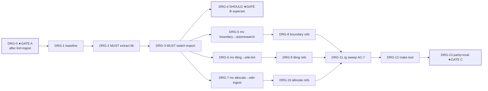

# Tasks — dragonscale-Cluster split + `lib/`-Extraktion

Atomare Ausführungs-Tasks für Manifest-Knoten `tasks-dragonscale`, abgeleitet aus [PLAN-dragonscale](../plans/PLAN-cmd-script-consolidation-dragonscale.md) (14 Schritte / Phasen 0–4 / Gates A–C). **Recorded, not executed** — reiner Refactor. Co-location **splittet** den Cluster auf 3 Skills; geteilter Code → `lib/dragonscale_pages.py`. **Cross-Cluster: läuft ERST nach `tasks-lint` UND `tasks-ingest` (`done`)** — tiling-check teilt `skills/wiki-lint/scripts/`, allocate-address teilt `skills/wiki-ingest/scripts/`. Node-Done = alle Tasks `done` + Manifest-verify (`dragonscale verortet + shared lib + Tests grün`).

## Labels
Taxonomie: [FUP-Tracker §Label taxonomy](dragonscale-agentic-wiki-followups.md). Hier: `feature` `bugfix` `maintenance` `review` `harness` `decision`. Surface: `code` · `doc`.

## Tasks

| ID | Task | Labels | Surface | Source | Prio | Depends on | Acceptance (binär) |
|---|---|---|---|---|---|---|---|
| **DRG-0** | **★GATE A** — Cross-Plan-Vorbedingung + sauberer Start | `review` `decision` | decision | Plan S1 / Gate A | P1 | `tasks-lint`, `tasks-ingest` (done) | `git status --porcelain` leer; Manifest zeigt `tasks-lint` + `tasks-ingest` = `done`/`verified` |
| **DRG-1** | Grün- + Verhaltens-Baseline aufnehmen | `harness` | code | Plan S2 | P1 | DRG-0 | `make test` Exit 0; `run-lint --json > baseline` ohne Fehler |
| **DRG-2** | **[MUST]** byte-identische Symbole → `lib/dragonscale_pages.py` extrahieren | `feature` `bugfix` | code | Plan S3 | P1 | DRG-1 | Vergleichs-Skript: extrahierte Blöcke (Konstanten + `log`) byte-identisch aus beiden Quellen |
| **DRG-3** | **[MUST]** `boundary-score` + `tiling-check` auf Import umstellen | `feature` | code | Plan S4 | P1 | DRG-2 | `rg 'EXCLUDE_TYPES\s*=\|def log\(' scripts/boundary-score.py scripts/tiling-check.py` == 0 (inline entfernt) |
| **DRG-4** | **[SHOULD, ★GATE B]** Superset `parse_frontmatter`/`included` — nur wenn beide Suiten grün | `feature` `review` | code | Plan S5 / Gate B | P2 | DRG-3 | `test_boundary_score` + `test_tiling_check` grün NACH Merge — sonst per-Skript belassen (Duplikat akzeptiert) |
| **DRG-5** | `boundary-score.py` → `skills/autoresearch/scripts/` (`git mv`) + `sys.path`-Tiefe | `feature` `bugfix` | code | Plan S6 | P1 | DRG-3 | `python3 skills/autoresearch/scripts/boundary-score.py --json --top 1` ohne `ImportError` |
| **DRG-6** | `tiling-check.py` → `skills/wiki-lint/scripts/` (`git mv`) + `sys.path`-Tiefe | `feature` `bugfix` | code | Plan S7 | P1 | DRG-3 | Ziel-Ordner existiert (aus tasks-lint), Skript verschoben, läuft |
| **DRG-7** | `allocate-address.py` → `skills/wiki-ingest/scripts/` (`git mv`) + `sys.path`-Tiefe | `feature` `bugfix` | code | Plan S8 | P1 | DRG-3 | `python3 skills/wiki-ingest/scripts/allocate-address.py --peek` ohne `ImportError` |
| **DRG-8** | `boundary-score`-Konsumenten-Refs aktualisieren | `maintenance` | code+doc | Plan S9 | P1 | DRG-5 | `rg 'scripts/boundary-score\.py'` (ohne `wiki/meta`, CHANGELOG) == 0 |
| **DRG-9** | `tiling-check`-Konsumenten-Refs aktualisieren | `maintenance` | code+doc | Plan S10 | P1 | DRG-6 | `rg 'scripts/tiling-check\.py'` (ohne Historie) == 0 |
| **DRG-10** | `allocate-address`-Konsumenten-Refs aktualisieren | `maintenance` | code+doc | Plan S11 | P1 | DRG-7 | `rg 'scripts/allocate-address\.py'` (ohne Historie) == 0 |
| **DRG-11** | Voller `rg`-Sweep aller 3 Skriptnamen (AC-7) | `review` | code | Plan S12 | P1 | DRG-8, DRG-9, DRG-10 | `rg 'scripts/(boundary-score\|tiling-check\|allocate-address)\.py'` (ohne Historie/`__pycache__`) == 0 |
| **DRG-12** | `make test` gesamt (AC-8) | `harness` | code | Plan S13 | P1 | DRG-11 | `make test` Exit 0; 100 % pass (insb. die 3 DragonScale-Tests) |
| **DRG-13** | Verhaltens-Parität + Eval (AC-9/10) + Commit — **★GATE C** | `review` `maintenance` | code | Plan S14 / Gate C | P1 | DRG-12 | `diff run-lint --json ↔ baseline` leer; autoresearch-Eval grün; kohärenter Commit; Push nach OK |

## Dependency graph

## Ordering

- **★GATE A (DRG-0):** harte Cross-Cluster-Vorbedingung — `tasks-lint` + `tasks-ingest` müssen `done` sein (geteilte Ziel-Ordner `wiki-lint/scripts/` + `wiki-ingest/scripts/`). Manifest erzwingt dies (`tasks-dragonscale` depends-on beide).
- **Extraktion VOR Move:** DRG-2/3 (lib isoliert) vor DRG-5/6/7 (Move) — Import-Umstellung erst, dann verschieben.
- **★GATE B (DRG-4):** Superset ist SHOULD — bei Test-Abweichung per-Skript belassen (reiner Refactor > DRY).
- **★GATE C (DRG-13):** Verhaltens-Parität (`run-lint --json` diff leer) + Eval vor Merge/Done; Push nach Freigabe.

## Risiken
Voll in [PLAN-dragonscale §Risiken](../plans/PLAN-cmd-script-consolidation-dragonscale.md). Kritisch: Superset-Merge ändert Verhalten (strict vs non-strict `resolve` → revert per-Skript), `sys.path`-Tiefe unkorrigiert → `ImportError`, vergessene Ref → silent no-op (nur `rg`=0-Sweep fängt es), Kollision mit `wiki-lint/scripts/` falls `tasks-lint` unvollständig.

> Einzelne Task → volle Spec/Task via `decide-next` promoten, sobald tracked → in-progress.
