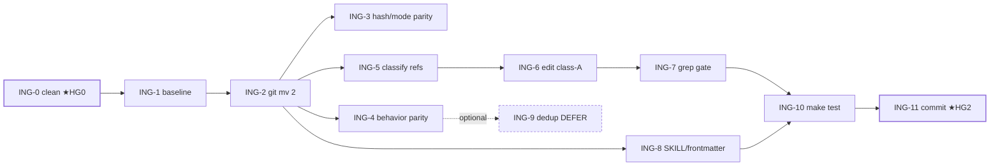

# Tasks — ingest-Cluster co-locate (`skills/wiki-ingest/scripts/`)

Atomare Ausführungs-Tasks für Manifest-Knoten `tasks-ingest`, abgeleitet aus [PLAN-ingest](../plans/PLAN-cmd-script-consolidation-ingest.md) (12 Schritte S1–S12 / HG0–HG2). **Recorded, not executed** — reiner Refactor, `git mv` zweier Stdlib-Standalones, identisches Verhalten. `resolve_vault`-Dedup **DEFER** (Präzedenz `cli_arg→env→cwd` divergiert von `lib/vault_root`; behavior-neutralen Move nicht an behavior-sensible Konsolidierung koppeln). **Downstream:** `tasks-dragonscale` hängt an diesem Knoten (allocate-address landet ebenfalls in `wiki-ingest/scripts/`). Node-Done = alle Tasks `done` + Manifest-verify (`ingest co-located + Refs + Tests grün`).

## Labels
Taxonomie: [FUP-Tracker §Label taxonomy](dragonscale-agentic-wiki-followups.md). Hier: `feature` `maintenance` `review` `harness`. Surface: `code` · `doc`.

## Tasks

| ID | Task | Labels | Surface | Source | Prio | Depends on | Acceptance (binär) |
|---|---|---|---|---|---|---|---|
| **ING-0** | Sauberer Start auf `main`/Arbeitsbranch — **★HG0** | `config` `review` | config | Plan S1 / HG0 | P1 | — | `git rev-parse --abbrev-ref HEAD` = Arbeitsbranch; `git status --short` ohne Änderung an den 2 Skripten (fremde `.cursor/.windsurf/visualize` unberührt) |
| **ING-1** | Verhaltens-Baseline erfassen (4 Artefakte + Dry-Run) | `harness` | code | Plan S2 | P1 | ING-0 | 4 Baseline-Artefakte nicht leer; beide Skripte Exit 0 im Dry-Run |
| **ING-2** | Beide Skripte `git mv` → `skills/wiki-ingest/scripts/` | `feature` | code | Plan S3 | P1 | ING-1 | `test -f skills/wiki-ingest/scripts/{rewrite-wikilinks,wiki-prepass}.py`; aus `scripts/` verschwunden |
| **ING-3** | Hash-/Mode-Parität nach Move | `review` | code | Plan S4 | P1 | ING-2 | `git hash-object` == S1-Hash (beide); Mode bleibt `100755`; `git status` = 2× `renamed:` |
| **ING-4** | Verhaltens-Parität (`--help` / Dry-Run-stdout / JSON-Report) | `review` `harness` | code | Plan S5 | P1 | ING-2 | `--help`, rewrite Dry-Run-stdout, prepass JSON-Report je neu==alt (Diff leer); beide Exit 0 |
| **ING-5** | Referenzen klassifizieren (A=Live-Pfad / B=Historie) | `review` | code | Plan S6 | P1 | ING-2 | `rg 'scripts/(rewrite-wikilinks\|wiki-prepass)'`-Fundstellen alle A/B-klassifiziert; Anzahl(A) == geplante Edits |
| **ING-6** | Klasse-(A)-Refs auf neuen Pfad editieren | `maintenance` | doc | Plan S7 | P1 | ING-5 | pro Edit nur Pfad-Tausch (keine Sinnänderung); falls keine A-Treffer: dokumentiert |
| **ING-7** | Grep-Gate: (a) alt == 0, (b) nur Klasse-B übrig | `review` | code | Plan S8 | P1 | ING-6 | (a) 0 Treffer; (b) ausschließlich upstream-roadmap-Historie + Vorhaben-Docs |
| **ING-8** | SKILL.md / frontmatter-Vertrag prüfen (kein Pfad-Ref, Schema stabil) | `review` | doc | Plan S9 | P1 | ING-2 | `rg 'rewrite-wikilinks\|wiki-prepass' skills/wiki-ingest/SKILL.md skills/wiki/references/frontmatter.md` == 0; Stub-Frontmatter-Felder unverändert |
| **ING-9** | *(optional, DEFER)* `resolve_vault`-Dedup nur mit Präzedenz-Test | `harness` | code | Plan S10 | P3 | ING-4 | nur falls ausgeführt: Präzedenz-Unit-Test (env+cli → cli gewinnt) grün + S4-Parität hält; **Default: übersprungen** |
| **ING-10** | Volle Test-Suite grün (Regression) | `harness` | code | Plan S11 | P1 | ING-7, ING-8 | `make test` endet „All tests passed.", Exit 0 |
| **ING-11** | Commit (2 Renames + ggf. A-Edits) — **★HG2** | `maintenance` | code | Plan S12 / HG2 | P1 | ING-10 | `git show --stat` = 2 Renames (+ evtl. A-Doc-Edits); Arbeitsbaum clean; Push nach OK |

## Dependency graph

## Ordering

- **Baseline VOR Move:** ING-1 vor ING-2; Parität-Checks (ING-3/4) direkt nach Move.
- **DEFER (ING-9):** Dedup ist `should`, default weggelassen — reiner Move ist behavior-neutral, Dedup ist behavior-sensibel (Präzedenz-Divergenz). Nur mit Präzedenz-Test einschalten.
- **★HG2 (ING-11):** Commit erst nach grüner Suite; Push nach Freigabe.
- **Downstream:** `tasks-dragonscale` (allocate-address → `wiki-ingest/scripts/`) startet erst wenn dieser Knoten `done`.

## Risiken
Voll in [PLAN-ingest §Risiken](../plans/PLAN-cmd-script-consolidation-ingest.md). Kritisch: `git mv` verliert Exec-Bit/Content (ING-3-Gate), versehentliches Editieren historischer Refs (ING-5-Klassifizierung + ★HG1), optionaler Dedup kippt Präzedenz auf env-first (DEFER + Präzedenz-Test). Hinweis: `pytest` nicht installiert → Gate ist `make test` (stdlib unittest).

> Einzelne Task → volle Spec/Task via `decide-next` promoten, sobald tracked → in-progress.
