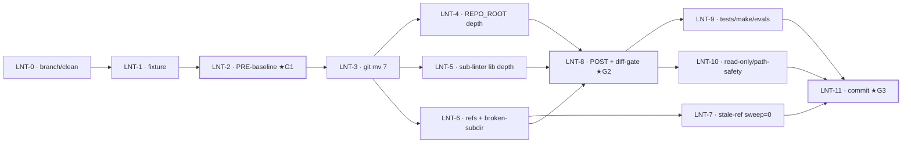

# Tasks — lint-Cluster co-locate (`skills/wiki-lint/scripts/`)

Atomare Ausführungs-Tasks für Manifest-Knoten `tasks-lint`, abgeleitet aus [PLAN-lint](../plans/PLAN-cmd-script-consolidation-lint.md) (15 Schritte / Gates 0–3 / R1–R7). **Recorded, not executed** — reiner Refactor, Zero-Behavior-Change (`run-lint --json` byte-identisch pre/post). Führt [FUP-4](dragonscale-agentic-wiki-followups.md) für den lint-Cluster aus. Node-Done = alle Tasks `done` + Manifest-verify (`lint co-located + run-lint --json diff leer + Tests grün`).

## Labels
Taxonomie: siehe [FUP-Tracker §Label taxonomy](dragonscale-agentic-wiki-followups.md). Hier genutzt: `feature` `bugfix` `maintenance` `harness` `review` `config`. Surface: `code` · `doc` · `config`.

## Tasks

| ID | Task | Labels | Surface | Source | Prio | Depends on | Acceptance (binär) |
|---|---|---|---|---|---|---|---|
| **LNT-0** | Dedizierten Feature-Branch anlegen, lint-Worktree clean | `config` `review` | config | Plan Gate 0 / S1 | P1 | — | `git rev-parse --abbrev-ref HEAD` = Feature-Branch; `git status --short` ohne lint-relevante/fremde Änderungen |
| **LNT-1** | Deterministischen Fixture-Vault materialisieren (`_seed_base_vault` → festes tmp) | `harness` | code | Plan S2 | P1 | LNT-0 | `<fixture>/wiki/` = vollständiger Seed; zweiter Seed-Lauf byte-gleich (Determinismus) |
| **LNT-2** | PRE-Move-Baseline erfassen (JSON + Report) — **★Gate 1** | `harness` `review` | code | Plan S3 / Gate 1 | P1 | LNT-1 | `lint-pre.json` valide, 9 Checks fixe Reihenfolge, Exit 0; Report gesichert |
| **LNT-3** | 7 Skripte atomar `git mv` → `skills/wiki-lint/scripts/` | `feature` `maintenance` | code | Plan S4–S5 | P1 | LNT-2 | `ls skills/wiki-lint/scripts/*.py` = 7; `scripts/{lint-*,run-lint}.py` leer; `git status` = 7× `renamed:` |
| **LNT-4** | `run-lint.py` `REPO_ROOT`-Tiefe fixen (`parent`→`parent.parent.parent`) | `bugfix` | code | Plan S6 | P1 | LNT-3 | Import-Smoke ohne `ModuleNotFoundError` (AC5); `_load_lint_module` unberührt |
| **LNT-5** | lib-Pfad-Tiefe in 3 Sub-Lintern fixen (`parent.parent`→`parent×4`); deps/programs/rename NICHT | `bugfix` | code | Plan S7 | P1 | LNT-3 | 3 Treffer neue Tiefe; 0 alte Tiefe; deps/programs/rename ohne `sys.path`-Edit |
| **LNT-6** | Referenzen updaten (Caller + Test-Konstanten + Broken-Subdir-Fix autoresearch) | `maintenance` `bugfix` | code+doc | Plan S8 | P1 | LNT-3 | `bin/release.py`, `evals/run.py`, `Makefile:30`, 4 Test-Konstanten, `autoresearch/SKILL.md`×4 → neuer Pfad; `lint-open-issues`-Refs unberührt |
| **LNT-7** | Stale-Ref-Sweep = 0 | `review` | code | Plan S9 | P1 | LNT-6 | `grep -E 'scripts/(run-lint\|lint-)'` (ohne Historie/Vorhaben-Docs) → nur `skills/wiki-lint/scripts/…`; autoresearch broken-subdir weg (AC6) |
| **LNT-8** | POST-Baseline + **★Diff-Gate** (PRE vs POST byte-identisch) — **★Gate 2** | `review` `harness` | code | Plan S10–S11 / Gate 2 | P1 | LNT-4, LNT-5, LNT-6 | JSON-`diff` leer (AC2); Report-`diff` nur Datumszeile (AC3) — sonst Rollback, kein Output-Patch |
| **LNT-9** | Test-Suite + `make` + Evals grün (neue Pfade) | `harness` `review` | code | Plan S12–S13 | P1 | LNT-8 | 4 Test-Files pass; `make test`+`make lint` Exit 0; Evals 100 % (AC4/AC7) |
| **LNT-10** | Read-only-Parität / path-safety unberührt | `review` | code | Plan S14 | P1 | LNT-8 | `hooks/wiki-path-safety.py` unverändert; im Fixture nur Report neu (AC8) |
| **LNT-11** | Ein kohärenter Conventional-Commit; Push/PR nur nach Freigabe — **★Gate 3** | `maintenance` | code | Plan S15 / Gate 3 | P1 | LNT-7, LNT-9, LNT-10 | `git show --stat` = 7 Renames + Edits in EINEM Commit; `refactor(lint): …`; Push erst nach OK |

## Dependency graph

## Ordering

- **Load-bearing:** LNT-1→2 (Baseline) **vor** LNT-3 (Move); LNT-4/5/6 **unmittelbar** nach LNT-3 (Zwischenzustand sonst rot); LNT-7 + LNT-8 + LNT-9/10 **vor** LNT-11 (Commit).
- **Ein Commit (nicht splitten):** LNT-3+4+5+6 = importlib-Cluster, gehören in denselben Commit (ADR-0002 „Rollout atomar").
- **Gates:** ★G1 (Baseline vor Move) · ★G2 (Diff-leer vor Commit; rot ⇒ Rollback R3) · ★G3 (Push nach Freigabe).
- **Cross-Cluster:** `tasks-dragonscale` hängt an diesem Knoten (tiling-check teilt `skills/wiki-lint/scripts/`) → dragonscale-Ausführung erst NACH LNT-11.

## Risiken
Vollständig in [PLAN-lint §Risiken & Rollback](../plans/PLAN-cmd-script-consolidation-lint.md) (R1–R7). Kritisch: R1 (Sub-Linter zurückgelassen → importlib bricht), R2 (falsche `.parent`-Tiefe), R3 (Diff nicht leer → Rollback statt Nachbessern).

> Einzelne Task → volle Spec/Task via `decide-next` promoten, sobald sie von tracked → in-progress wechselt.
