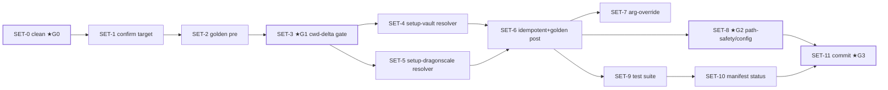

# Tasks — setup-Cluster Dedup (bleibt in `bin/`)

Atomare Ausführungs-Tasks für Manifest-Knoten `tasks-setup`, abgeleitet aus [PLAN-setup](../plans/PLAN-cmd-script-consolidation-setup.md) (12 Schritte / Phasen A–E / Gates G0–G3). **Recorded, not executed** — reiner Refactor. **Kein Move** ([ADR-0003](../adr/0003-setup-cluster-stays-in-bin.md): Installer bleiben `bin/`); der Gewinn ist Dedup der Vault-Root-Auflösung auf `lib/vault_root.py`. `bin/_setup_common.py` **SKIP** (gemeinsame Schnittmenge < ~10 LOC — keine Abstraktion für Einmal-Nutzung). `setup-multi-agent.py` unberührt (teilt keine Logik). Node-Done = alle Tasks `done` + Manifest-verify (`setup verortet + Aufrufer aktualisiert + Smoke grün`).

## Labels
Taxonomie: [FUP-Tracker §Label taxonomy](dragonscale-agentic-wiki-followups.md). Hier: `bugfix` `maintenance` `review` `harness` `config`. Surface: `code` · `config`.

## Tasks

| ID | Task | Labels | Surface | Source | Prio | Depends on | Acceptance (binär) |
|---|---|---|---|---|---|---|---|
| **SET-0** | Sauberer Ausgangszustand + Branch (**★G0**) | `config` `review` | config | Plan S1 / G0 | P1 | — | `git status --porcelain` ohne Änderung in `bin/`/`hooks/`; intendierter Arbeitsbranch |
| **SET-1** | Dedup-Ziel per Evidenz bestätigen | `review` | code | Plan S2 | P1 | SET-0 | `rg -c "vault = Path\(sys\.argv\[1\]\) …else SCRIPT_DIR\.parent" bin/setup-vault.py bin/setup-dragonscale.py` == 1 je Datei |
| **SET-2** | Golden-Baseline erzeugen (Verhaltens-Snapshot PRE) | `harness` | code | Plan S3 | P1 | SET-1 | `$TMPDIR/golden-pre.txt` (Pfad→sha256) für beide; Skripte Exit 0 |
| **SET-3** | **★G1** — cwd-Fallback-Delta beweisen (Gate für Dedup) | `review` `decision` | decision | Plan S4 / G1 | P1 | SET-2 | Fall (a)+(b): Resolver == altes Idiom → identischer `Path`; `$TMPDIR/gate-precedence.txt` = „PASS" |
| **SET-4** | `setup-vault.py`: Inline-Auflösung → `resolve_vault_root` | `bugfix` | code | Plan S5 | P1 | SET-3 | `rg -c resolve_vault_root bin/setup-vault.py` == 1; altes Idiom weg; Modul importierbar |
| **SET-5** | `setup-dragonscale.py`: → `resolve_vault_root` (Reihenfolge zu `os.chdir` wahren) | `bugfix` | code | Plan S6 | P1 | SET-3 | `rg -c resolve_vault_root bin/setup-dragonscale.py` == 1; `resolve_vault_root(` erscheint **vor** `os.chdir(` |
| **SET-6** | Idempotenz + Golden-Vergleich POST | `review` `harness` | code | Plan S7 | P1 | SET-4, SET-5 | `golden-pre.txt` == `golden-post.txt` (diff leer); 2. Lauf jedes Skripts = No-Op |
| **SET-7** | Argument-Override-Regression | `review` | code | Plan S8 | P1 | SET-6 | `python3 bin/setup-vault.py "$TMPDIR/ov"` schreibt nach `$TMPDIR/ov`, nicht Repo-Root; `git status bin/ hooks/` unverändert |
| **SET-8** | **★G2** — path-safety + `config.json` unverändert (Security) | `review` | config | Plan S9 / G2 | P1 | SET-6 | `git diff --exit-code -- hooks/wiki-path-safety.py` leer; `config.json`-Block (strict/mixed, TTY-Gate) inhaltlich unverändert |
| **SET-9** | Volle Test-Suite + Make-Target (Regression) | `harness` | code | Plan S10 | P1 | SET-6 | `make test` → alle 10 `tests/` grün (insb. `test_vault_root`, `test_run_lint`) |
| **SET-10** | Manifest-Status für Modul `setup` fortschreiben | `maintenance` | doc | Plan S11 | P1 | SET-9 | `git diff` betrifft nur die 2 `bin/`-Skripte + optional Manifest; nichts unter `skills/`/`scripts/`/`hooks/` |
| **SET-11** | Commit (**★G3** vor Push) | `maintenance` | code | Plan S12 / G3 | P1 | SET-8, SET-10 | `git show --stat` = nur die 2 `bin/`-Skripte (+ ggf. Manifest); `refactor(setup): dedup vault-root …`; Push nach OK |

## Dependency graph

## Ordering

- **★G1 (SET-3) blockt Dedup:** SET-4/5 dürfen NICHT vor grünem cwd-Fallback-Delta-Gate starten (sonst Risiko Verhaltensänderung env-first vs SCRIPT_DIR.parent).
- **★G2 (SET-8):** Security-Gate — `hooks/wiki-path-safety.py` + `config.json` beweisbar unberührt vor Commit.
- **★G3 (SET-11):** Push nach Freigabe.
- **Kein Move / SKIP:** Skripte bleiben `bin/` (ADR-0003); `_setup_common.py` nicht anlegen; `setup-multi-agent.py` nicht anfassen.
- **Parallel-safe:** `bin/` disjunkt zu allen Skill-Dirs → parallel zu lint/ingest/commands/dragonscale.

## Risiken
Voll in [PLAN-setup §Risiken](../plans/PLAN-cmd-script-consolidation-setup.md). Kritisch: cwd-Fallback-Delta real (★G1 fängt es, sonst STOP + Fallback-Helper-Variante), `resolve_vault_root(` nach `os.chdir(` → falscher Root (SET-5-Reihenfolge), versehentlicher path-safety-Hook-Edit (★G2 `git diff --exit-code`).

> Einzelne Task → volle Spec/Task via `decide-next` promoten, sobald tracked → in-progress.
