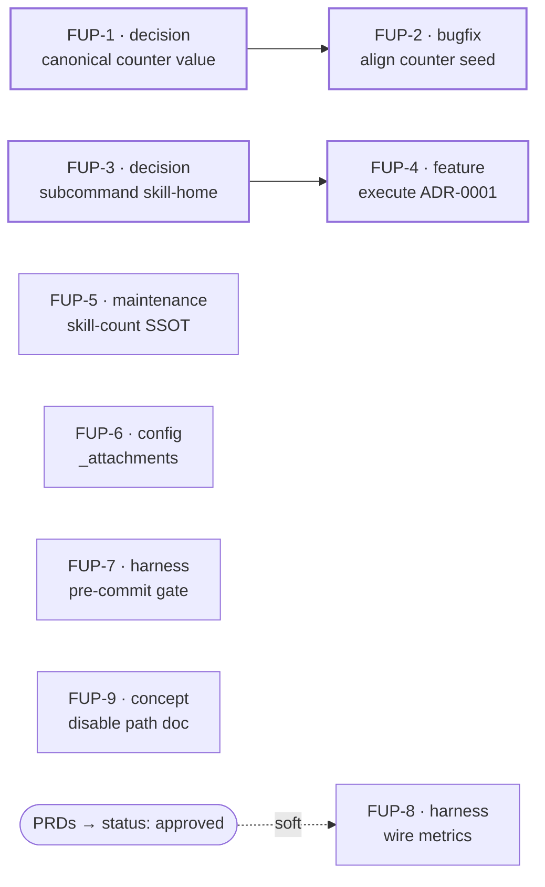

# Follow-up Tasks — DragonScale & Agentic Wiki PRDs

Consolidated tracker for the open items surfaced while authoring [DragonScale PRD](../prds/dragonscale.md) and [Agentic Wiki PRD](../prds/agentic-wiki.md) (2026-07-01 docs audit + platform inventory). These are **recorded, not executed** — most need script/config edits that were deliberately deferred (the audit round was docs-only). Decisions are split from the fixes they gate, so the dependency graph is explicit. Scaffolded decisions are tracked in the decide-next manifest [docs/manifests/dragonscale-agentic-wiki-followups.json](../manifests/dragonscale-agentic-wiki-followups.json): FUP-1 → [ADR-0004](../adr/0004-canonical-address-counter-start.md) (**accepted**), FUP-3 → [ADR-0005](../adr/0005-skill-home-open-issues-commands.md) (**accepted**), the latter fleshed out by [SPEC-wiki-issues](../specs/SPEC-wiki-issues.md) + the [open-issues template](../templates/open-issues.md) — both derived from the battle-tested `ai-secondbrain` reference vault.

> **Update 2026-07-01 (post-audit `docs/audit/2026-07-01/`):** ADR-0005 ratified (**accepted**); **FUP-2 executed** (docs-only hold lifted for it) — `bin/setup-vault.py` seed `0`→`1`, guarded by `tests/test_setup_provisioning.py` (9 checks green). Remaining FUPs are still recorded-not-executed.

## Label taxonomy

| Label | Meaning |
|---|---|
| `decision` | A choice must be made/recorded (ADR-level) before dependent work can start. |
| `concept` | Design/definition work (where something lives, what shape it takes). |
| `bugfix` | Corrects wrong behavior in shipped code. |
| `feature` | New/removed capability (incl. executing an accepted refactor). |
| `config` | Repo config / files / directories (non-executable). |
| `harness` | Test / CI / eval / pre-commit tooling. |
| `maintenance` | Housekeeping: docs↔reality sync, dead refs, drift. |
| `review` | Verification pass, no new artifact. |
| `research` · `misc` | (defined for completeness; unused here) |

Surface = where the change lands: `code` · `doc` · `config` · `decision`.

## Tasks

| ID | Task | Labels | Surface | Source | Prio | Depends on | Acceptance |
|---|---|---|---|---|---|---|---|
| **FUP-1** | Decide canonical address-counter start value (`0` vs `1`) → **[ADR-0004](../adr/0004-canonical-address-counter-start.md)** (accepted: canonical = `1`) | `decision` | decision | DS PRD §7 | P1 | — | ADR-0004 ratified by owner (status → accepted). |
| **FUP-2** ✅ | Align counter seed across `bin/setup-vault.py` & `bin/setup-dragonscale.py` (both `1`) | `bugfix` `config` | code | DS PRD §7 / R3 | P1 | FUP-1 | **Done 2026-07-01:** both seed `1`; `tests/test_setup_provisioning.py` asserts first alloc `c-000001` (9 checks green); guide + PRD already stated `1`. |
| **FUP-3** ✅ | Decide skill-home for substantive `wiki/` subcommands (`fix-issues`, `handoff`) → **[ADR-0005](../adr/0005-skill-home-open-issues-commands.md)** (**accepted**: new `wiki-issues` skill) | `decision` `concept` | decision | Wiki PRD §7 / ADR-0001 | P1 | — | ADR-0005 ratified by owner (status → accepted). |
| **FUP-4** | Execute ADR-0001: delete 5 thin-wrapper commands, rehome the 2 substantive ones per **[SPEC-wiki-issues](../specs/SPEC-wiki-issues.md)** | `feature` `maintenance` | code+doc | Wiki PRD §7 | P1 | FUP-3 | Wrapper commands removed; `wiki-issues` skill built per spec (AC1–AC7); docs updated; CI green. |
| **FUP-5** | Establish skill-count SSOT; fix drift (`copilot-instructions.md` says 13, disk has 14) | `maintenance` | doc+config | Wiki PRD §7 | P2 | — | Single source for the skill inventory; all counts read 14; a lint/test guards future drift. |
| **FUP-6** | Resolve `_attachments/` absence (create dir or de-reference) | `config` `maintenance` | config+doc | Wiki PRD §7 | P2 | — | Either `_attachments/.gitkeep` exists or all refs (CLAUDE.md, `.gitignore`) removed — consistent either way. |
| **FUP-7** | Add local pre-commit gate (`.pre-commit-config.yaml` → `run-lint.py`) | `harness` `config` | config | Wiki PRD §7 / roadmap PR3a | P2 | — | `.pre-commit-config.yaml` runs the lint aggregator locally; documented; matches roadmap PR3a/PR3b intent. |
| **FUP-8** | Wire PRD success metrics to tests/evals/lint (DS G1–G4, Wiki G1–G5) | `harness` `review` | code | both PRD checklists | P2 | PRDs approved (soft) | Each success metric maps to a concrete assertion in `tests/`, `evals/`, or the lint gate. |
| **FUP-9** | Document DragonScale reversible disable path end-to-end | `concept` | doc | DS PRD checklist / R6 | P2 | — | Guide section: how to disable each mechanism and return to base behavior; verified. |

## Dependency graph

## Ordering

- **First (P1):** the two decision→fix chains — FUP-1→FUP-2 (counter) and FUP-3→FUP-4 (commands). FUP-4 is the active `cmd-script-consolidation` plan; its specs/plans already exist.
- **Then (P2), independent, parallelizable:** FUP-5, FUP-6, FUP-7, FUP-9.
- **Last:** FUP-8 (metrics harness) — most valuable once the PRDs move `draft → approved` so the metric set is frozen.

> Promote any single task to a full Spec/Task via the `decide-next` workflow when it moves from tracked to in-progress.
