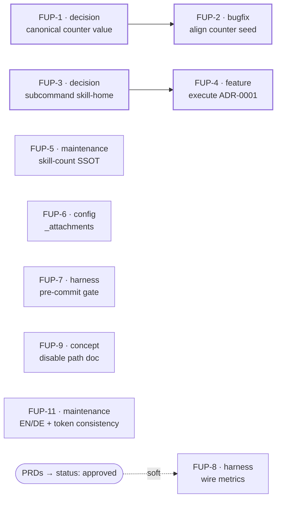

# Follow-up Tasks — DragonScale & Agentic Wiki PRDs

Consolidated tracker for the open items surfaced while authoring [DragonScale PRD](../prds/dragonscale.md) and [Agentic Wiki PRD](../prds/agentic-wiki.md) (2026-07-01 docs audit + platform inventory). These are **recorded, not executed** — most need script/config edits that were deliberately deferred (the audit round was docs-only). Decisions are split from the fixes they gate, so the dependency graph is explicit. Scaffolded decisions are tracked in the decide-next manifest [docs/manifests/dragonscale-agentic-wiki-followups.json](../manifests/dragonscale-agentic-wiki-followups.json): FUP-1 → [ADR-0004](../adr/0004-canonical-address-counter-start.md) (**accepted**), FUP-3 → [ADR-0005](../adr/0005-skill-home-open-issues-commands.md) (**accepted**), the latter fleshed out by [SPEC-wiki-issues](../specs/SPEC-wiki-issues.md) + the [open-issues template](../templates/open-issues.md) — both derived from the battle-tested `ai-secondbrain` reference vault.

> **Update 2026-07-01 (post-audit `docs/audit/2026-07-01/`):** ADR-0005 ratified (**accepted**); **FUP-2 executed** (docs-only hold lifted for it) — `bin/setup-vault.py` seed `0`→`1`, guarded by `tests/test_setup_provisioning.py` (9 checks green). Remaining FUPs are still recorded-not-executed.

## Label taxonomy

| Label | Meaning |
|---|---|
| `decision` | A choice must be made/recorded (ADR-level) before dependent work can start. |
| `concept` | Design/definition work (where something lives, what shape it takes). |
| `bugfix` | Corrects wrong behavior in shipped code. |
| `feature` | New/removed capability (incl. executing an accepted refactor). |
| `config` | Repo config / files / directories (non-executable). |
| `harness` | Test / CI / eval / pre-commit tooling. |
| `maintenance` | Housekeeping: docs↔reality sync, dead refs, drift. |
| `review` | Verification pass, no new artifact. |
| `research` · `misc` | (defined for completeness; unused here) |

Surface = where the change lands: `code` · `doc` · `config` · `decision`.

## Tasks

| ID | Task | Labels | Surface | Source | Prio | Depends on | Acceptance |
|---|---|---|---|---|---|---|---|
| **FUP-1** | Decide canonical address-counter start value (`0` vs `1`) → **[ADR-0004](../adr/0004-canonical-address-counter-start.md)** (accepted: canonical = `1`) | `decision` | decision | DS PRD §7 | P1 | — | ADR-0004 ratified by owner (status → accepted). |
| **FUP-2** ✅ | Align counter seed across `bin/setup-vault.py` & `bin/setup-dragonscale.py` (both `1`) | `bugfix` `config` | code | DS PRD §7 / R3 | P1 | FUP-1 | **Done 2026-07-01:** both seed `1`; `tests/test_setup_provisioning.py` asserts first alloc `c-000001` (9 checks green); guide + PRD already stated `1`. |
| **FUP-3** ✅ | Decide skill-home for substantive `wiki/` subcommands (`fix-issues`, `handoff`) → **[ADR-0005](../adr/0005-skill-home-open-issues-commands.md)** (**accepted**: new `wiki-issues` skill) | `decision` `concept` | decision | Wiki PRD §7 / ADR-0001 | P1 | — | ADR-0005 ratified by owner (status → accepted). |
| **FUP-4** | Execute ADR-0001: delete 5 thin-wrapper commands, rehome the 2 substantive ones per **[SPEC-wiki-issues](../specs/SPEC-wiki-issues.md)** | `feature` `maintenance` | code+doc | Wiki PRD §7 | P1 | FUP-3 | Wrapper commands removed; `wiki-issues` skill built per spec (AC1–AC7); docs updated; CI green. **+V-3:** user-facing command-migration handled — CHANGELOG/release-note deprecation + `wiki-issues` gives equivalent invocation (plugin is released v1.10.1; 2 substantive cmds undocumented, 5 wrappers skill-redundant → low burden). **+V-6:** section-whitelist reconciled between SPEC-wiki-issues and the `commands/` migration source. |
| **FUP-5** | Establish skill-count SSOT + drift guard; ship `visualize` (15th skill) to resolve the 14-vs-15 ambiguity, executing the decision-locked `PLAN-visualize-integration` on current HEAD (no `commands/`, no windsurf/cursor; count →15) | `maintenance` `feature` | doc+config+code | Wiki PRD §7 · [SPEC-fup-5](../specs/SPEC-fup-5-skill-count-ssot.md) | P2 | — | `visualize` git-tracked (15th skill), SKILL.md trimmed 50→11 KB + wired (allowed-tools, `wiki/visualizations/` output + stub, canvas boundary); tracked `skills/*/SKILL.md` set is the SSOT; every count literal + enumeration reads **15** (incl. AGENTS/GEMINI, which also gained the missing `wiki-issues` row); `tests/test_skill_count_ssot.py` guards drift, wired into `make test`; `make test` + `run-lint` green. Plugin version bump →1.11.0 + tag deferred to `make release` at push. |
| **FUP-6** | Resolve `_attachments/` absence (create dir or de-reference) | `config` `maintenance` | config+doc | Wiki PRD §7 | P2 | — | Either `_attachments/.gitkeep` exists or all refs (CLAUDE.md, `.gitignore`) removed — consistent either way. |
| **FUP-7** | Add local pre-commit gate (`.pre-commit-config.yaml` → `run-lint.py`) | `harness` `config` | config | Wiki PRD §7 / roadmap PR3a | P2 | — | `.pre-commit-config.yaml` runs the lint aggregator locally; documented; matches roadmap PR3a/PR3b intent. |
| **FUP-8** | Wire PRD success metrics to tests/evals/lint (DS G1–G4, Wiki G1–G5) | `harness` `review` | code | both PRD checklists | P2 | PRDs approved (soft) | Each success metric maps to a concrete assertion in `tests/`, `evals/`, or the lint gate. **+V-5:** incl. DS G0 "strictly-optional" assertion (test proves each mechanism is skippable → base behavior). |
| **FUP-9** | Document DragonScale reversible disable path end-to-end | `concept` | doc | DS PRD checklist / R6 | P2 | — | Guide section: how to disable each mechanism and return to base behavior; verified. |
| **FUP-10** ✅ | Planning-doc over-build (6.6:1 on `cmd-script-consolidation`; ~500–600 trimmable doc-lines) — **decision: keep, accepted, no trim** | `review` | decision | Audit V-4 | — | — | **Recorded 2026-07-01 (accepted):** committed & mostly-done docs; trimming = churn > value. No action; revisit only if the pending refactor paths are reopened. |
| **FUP-11** ✅ | Consistency: ADR/PRD heading-language EN/DE split (pre-existing German vs this-session English) + document the manifest lifecycle-token mapping (`verified`/`todo` ↔ `accepted`/`proposed`) | `maintenance` | doc | Audit V-7 | P2 | — | **Done 2026-07-01:** Language policy stated (English for ADRs/config per CLAUDE.md) and applied-or-waived per file; token mapping documented in the manifest/tracker header. See the [Conventions](#conventions) section. |

## Dependency graph

## Ordering

- **First (P1):** the two decision→fix chains — FUP-1→FUP-2 (counter) and FUP-3→FUP-4 (commands). FUP-4 is the active `cmd-script-consolidation` plan; its specs/plans already exist.
- **Then (P2), independent, parallelizable:** FUP-5, FUP-6, FUP-7, FUP-9, FUP-11.
- **Last:** FUP-8 (metrics harness) — most valuable once the PRDs move `draft → approved` so the metric set is frozen.
- **Closed:** FUP-10 (over-build) — accepted, no action.

> Promote any single task to a full Spec/Task via the `decide-next` workflow when it moves from tracked to in-progress.

## Value-audit integration (2026-07-01)

Routing of the audit's `value`-class findings ([AUDIT-REPORT §4](../audit/2026-07-01/AUDIT-REPORT.md)) into this tracker + existing artifacts (V-1/V-2 already resolved this session: FUP-2 counter fix + provisioning test):

| Finding | Disposition | Lands in |
|---|---|---|
| V-3 command-migration | fold into FUP-4 | FUP-4 acceptance · agentic-wiki PRD (requirement) · ADR-0001 (consequence) |
| V-4 planning over-build 6.6:1 | **keep, accepted** (no trim) | FUP-10 (recorded) |
| V-5 G0 "strictly-optional" unasserted | integrate | FUP-8 acceptance · dragonscale PRD (binary acceptance) |
| V-6 section-whitelist divergence | fold into FUP-4 | FUP-4 acceptance (SPEC-wiki-issues reconcile) |
| V-7 EN/DE + manifest-token | new task | FUP-11 |

**Pending artifact edits** (parallel-safe, doc-only) tracked in the manifest as `value-prd-adr-edits`: agentic-wiki PRD (V-3 requirement), dragonscale PRD (V-5 acceptance), ADR-0001 (V-3 migration consequence).

## Conventions

Two low-severity consistency items from [AUDIT-REPORT V-7](../audit/2026-07-01/AUDIT-REPORT.md), recorded here as decided policy:

- **Doc language.** Engineering docs (ADRs, specs, PRDs) use **English** going forward — per the user's CLAUDE.md (English for config/code/docs; German only for chat/README/customer-facing). The pre-existing German ADRs (0001–0003) + `cmd-script-consolidation` PRD are **grandfathered — waived, not retranslated** (churn > value). This-session artifacts (ADR-0004/0005, DragonScale + Agentic Wiki PRDs) are already English.
- **Manifest token mapping.** The [decide-next manifest](../manifests/dragonscale-agentic-wiki-followups.json) uses lifecycle tokens that map to ADR status by design (decide-next lifecycle vs ADR status), not by literal string match: `verified` ⇄ ADR `accepted`; `todo` ⇄ ADR `proposed`; `in_progress` = claimed/underway. Each node's `verify` field states the ratification condition. Not a mismatch.
